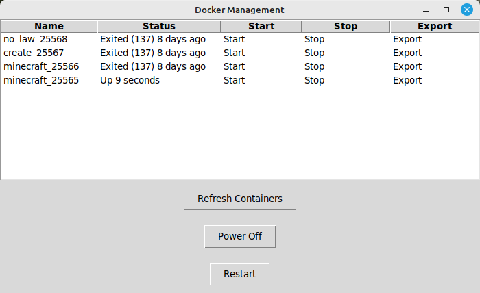

# DockerCraftPi
J'ai créé ce projet pour amuser les enfants à la maison.
Le projet permet d'avoir autant de serveurs minecraft que l'on veut en utilisant un port différent par docker.
Une interface graphique permet de commander le Raspberry à distance pour:
1. Avoir la liste de tous les Dockers du Raspberry
2. Démarrer/Arrêter le ou les Dockers au choix
3. Extraire la sauvegarde du jeu sur l'ordinateur
4. Redémarrer le Raspberry
5. Éteindre le raspberry


## 1. Installer Raspbian Lite sur le raspberry

## 2. Configurer le raspberry
```bash
sudo apt-get update -y
sudo apt-get upgrade -y
sudo apt-get install -y git curl
```

## 3. Actions optionnelles permettant le contrôle à distance du PI via SSH
Activer la connection SSH:
```bash
sudo raspi-config
```
Pour permettre l'extinction et le redémarrage sans mot de passe, il faut changer les droits sur ces actions.  
Sur le raspberry faire:
```bash
sudo visudo
```
Dans le fichier visudo, taper ceci en remplaçant `username` par le nom d'utilisateur utilisé pour les connexions SSH. 
```bash
username ALL=(ALL) NOPASSWD: /sbin/shutdown, /sbin/reboot
```

## 4. Installer Docker sur le raspberry
```bash
sudo apt-get update -y
curl -sSL https://get.docker.com | sh
sudo usermod -aG docker $USER
```
Redémarrer le Raspberry!<br>
Tester l'installation:
```bash
docker run hello-world
```

## 5. Création de l'image Docker
Afin de structurer votre projet, créer un dossier et placez-vous dedans
```bash
mkdir -p ~/minecraft_docker
cd ~/minecraft_docker
```
<br>Importer avec la commande **git clone https://github.com/ValentinLibouton/DockerCraftPi.git**<br>
ou créer et copier le contenu des fichiers proposé dans le répertoire de ce github:

### 5.1 `start-minecraft.sh`
```bash
sudo nano start-minecraft.sh
```
- Copier le contenu du `start-minecraft.sh` de ce projet dans le vôtre.

### 5.2 `Dockerfile:`
J'ai choisi de mettre _25565 à la fin du nom afin de garder une trace des différentes versions
```bash
sudo nano Dockerfile_25565
```
- Copier le contenu du `Dockerfile` de ce projet dans le vôtre. 
- Dans `Dockerfile`, remplacer la ligne ci-dessous pour mettre la version de serveur que vous désirez
```bash
RUN wget https://api.papermc.io/v2/projects/paper/versions/1.20.4/builds/464/downloads/paper-1.20.4-464.jar -O papermc.jar
```
- Ajouter les plugins désirés tels qu'en exemple avec `LuckPerms-Bukkit.jar`
- Dans `Dockerfile`, remplacer le port désiré:
```bash
EXPOSE 25565
```
### 5.3 `server.properties`
```bash
sudo nano server.properties
```
- Copier le contenu du `server.properties` de ce projet dans le vôtre.
- Dans `server.properties`, changer la ligne ci-dessous pour le port désiré:
```bash
server-port=25565
```
- C'est le moment si vous voulez changer la seed ou mettre `online-mode=true` comme à l'origine!
- Construire l'image, j'ai choisi de tagger avec le num de port dans le nom pour retrouver plus facilement
```bash
docker build --file Dockerfile_25565 --tag minecraft_p_25565 .
```

## 6. Premier démarrage du serveur depuis l'image
Deux choix s'offrent à vous, démarrage du conteneur automatiquement au démarrage du pi, ou manuel    
Si vous voulez faire tourner plusieurs conteneurs, il vaut mieux les démarrer manuellement!  
Automatique:
```bash
docker run --restart=always -p 25565:25565 --name minecraft_25565 minecraft_p_25565
```
Manuel:
```bash
docker run -p 25565:25565 --name minecraft_25565 minecraft_p_25565
docker start minecraft_25565
```

## 7. Commande distante du raspberry `remote_gui/docker_craft_pi.py` 
Ce petit programme à exécuter depuis l'ordinateur permet de démarrer les divers conteneurs, exporter la sauvegarde du jeu, éteindre et redémarrer le Raspberry Pi
```bash
python3 ~/remote_gui/docker_craft_pi.py
```
---------------------------------------------------------
## Résumé des commandes Docker utiles
```shell
docker --help
```

```shell
docker build --file Dockerfile --tag minecraft_pi_server .
```

```shell
docker run --restart=always -p 25565:25565 --name minecraft minecraft_pi_server
```

```shell
docker start <name>
docker stop <name>
```

```shell
docker save nom_image > mon_image.tar

```

```shell
docker ps
```

```shell
docker container ls -a
```

```shell
docker images
```

```shell
docker exec -it <name> bash
```

Suppression d'un conteneur
```shell
docker rm <id>
```

Suppression d'une image
```shell
docker rmi -f <IMAGE ID>
```

--------------------------
## Overclock du PI5
/boot/firmware/config.txt
```bash
arm_freq=2900
gpu_freq=1000
force_turbo=1
```